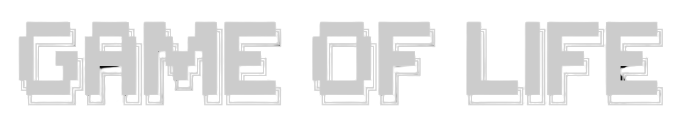

<div align=center>
  
</div>

## Introduction

This is a simple implementation of Conway's Game of Life in Python using `Numpy` and `Matplotlib`. It also uses the `OpenCV` library to save the frames as images and convert them to a video.

## Usage

- Install the dependencies using `pip install -r requirements.txt`

- Run the script using `python main.py`

You now have multiple options :
- Press `Space` to **pause** or **resume** the game
- When the game isn't running : 
  - **Click** on the cells to make them alive or dead
  - Press `C` to **clear** the board
  - Press `R` to generate a **random** board
  - Press `E` to **export** the last frames as a video

> You can change some parameters in the `main.py` file

### Example


## Conway's Game of Life

The Game of Life is a cellular automaton devised by the British mathematician John Horton Conway in 1970. It is a zero-player game, meaning that its evolution is determined by its initial state, requiring no further input.

The universe of the Game of Life is an infinite two-dimensional orthogonal grid of square cells, each of which is in one of two possible states, alive or dead, or "populated" or "unpopulated". Every cell interacts with its eight neighbours, which are the cells that are horizontally, vertically, or diagonally adjacent.

At each step in time, the following transitions occur:

- Any live cell with fewer than two live neighbours dies, as if by underpopulation.

- Any live cell with two or three live neighbours lives on to the next generation.

- Any live cell with more than three live neighbours dies, as if by overpopulation.

- Any dead cell with exactly three live neighbours becomes a live cell, as if by reproduction.

The initial pattern constitutes the seed of the system. The first generation is created by applying the above rules simultaneously to every cell in the seed; births and deaths occur simultaneously, and the discrete moment at which this happens is sometimes called a tick. Each generation is a pure function of the preceding one. The rules continue to be applied repeatedly to create further generations.

## Implementation

The game is implemented using a 2D matrix of 0s and 1s (or False and True). 0s represent dead cells and 1s represent live cells.

The matrix is stored in a numpy array. The game's rules are based on neighbours, so we will ignore the cells on the edges of the matrix.

We create a new empty matrix called `neighbours` that will contain the number of neighbours for each cell, with the same shape as the `board` matrix.

```python
neighbours = np.zeros(board.shape)
```

Then for each cell inside the `board` matrix (excluding the edges), we compute the number of neighbours in the 8 surrounding cells.

```python
neighbours[1:-1, 1:-1] = (
    board[:-2,:-2]  + board[:-2,1:-1] + board[:-2,2:]  +
    board[1:-1,:-2] +                   board[1:-1,2:] + 
    board[2:,:-2]   + board[2:,1:-1]  + board[2:,2:]
)
```

We now have a new matrix `neighbours` that contains the number of neighbours for each cell.

Then we perform an element-wise logical AND inside an element-wise logical OR operation :

- If a cell has exactly 3 neighbours, it's now a live cell  

OR
- If a cell is alive AND has exactly 2 neighbours, it's still a live cell  
 
> NB: In all other cases, it's a dead cell

```python
board = np.logical_or(neighbours==3, np.logical_and(board==1, neighbours==2))
```

This is one generation of the game. We can repeat this process as many times as we want.
